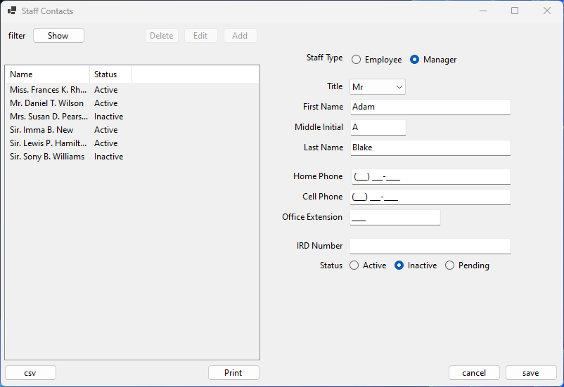
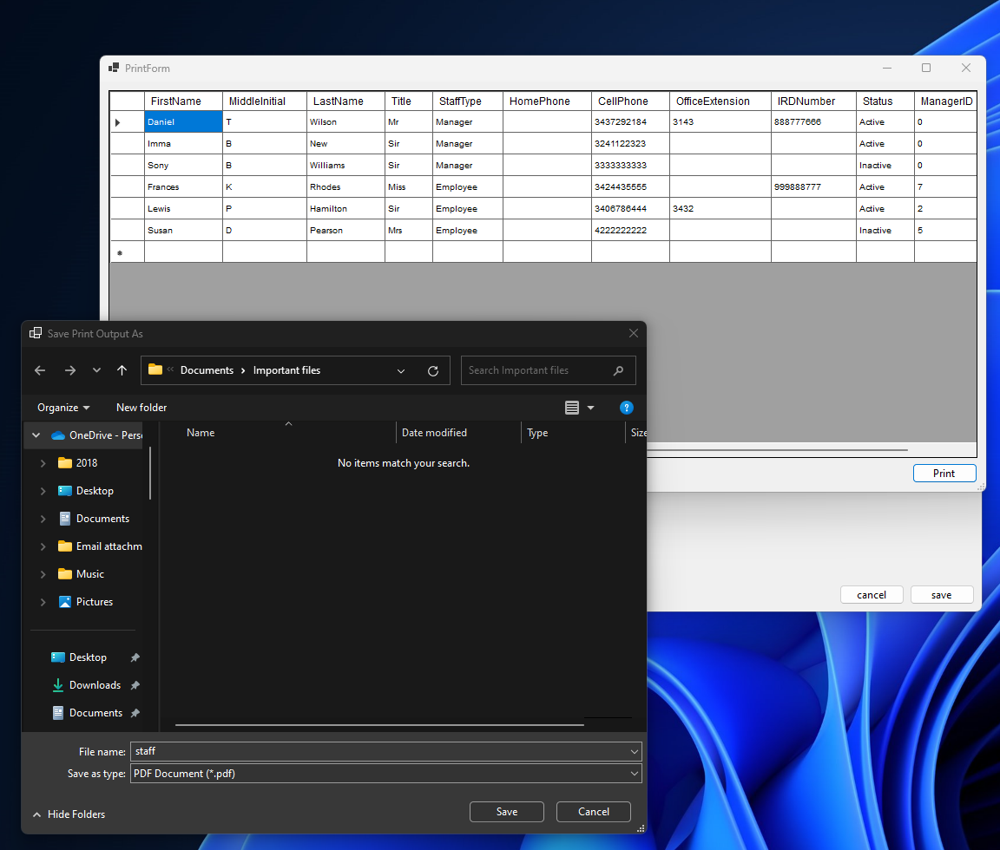
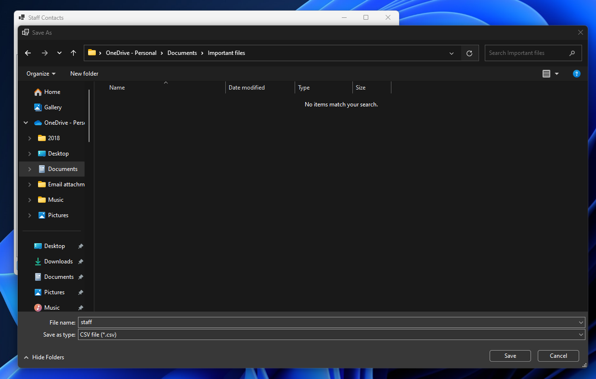

# staff_contact_app_winform
A super simple staff contact application to show basic crud opperations.
* Create,edit and delete contacts from SQLite database.
* Filter contacts by "Active" status.
* Designate contacts to be managers and assign to employees.
* Print tabulated data or export as csv file.
Code has:
* Some data handling to prevent incorrect actions.
* Basic Documentation.

## Screenshots

### Printing tabulated data

### Saving data to csv file

